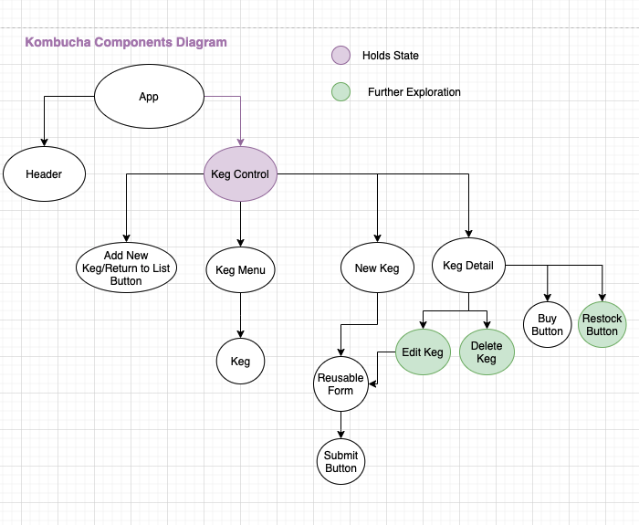

# 
Kombucha Bar

     
    

  <small>Last Updated: February 12th, 2021</small>

# ℹ️ Description

 Tap Room, Friday Project for Epicodus 
This will be a two-week project. Spend today building a tap room in React where a bar or kombucha store can track their kegs. This could also be a soda fountain or another kind of tracker - as long as you're able to track the remaining amount and meet the objectives, you can be creative with this prompt.

Before getting started, plan out your application and draw a component tree or component diagram that shows the structure of your components. This is a requirement for the project and should be included in your README. You may draw the structure on a piece of paper and take a picture of it or use an application like https://www.draw.io/.

# 💁🏽‍♀️ User Stories

Here are some user stories to get you started. The application should have the following functionality:

* As a user, I want to see a list/menu of all available kegs. For each keg, I want to see its name, brand, price and alcoholContent (or perhaps something like flavor for a kombucha store).
* As a user, I want to submit a form to add a new keg to a list.
* As a user, I want to be able to click on a keg to see its detail page.
* As a user, I want to see how many pints are left in a keg. Hint: A full keg has roughly 124 pints.
* As a user, I want to be able to click a button next to a keg whenever I sell a pint of it. This should decrease the number of pints left by 1. Pints should not be able to go below 0.

# 🧗🏼‍♀️ Further Exploration

## Completed:
* As a user, I want to be able to restock kegs.
* As a user, I want to be able to press a button to tap a keg if there is one instock.
* As a user, I want a keg to update to say "Out of Stock" once it's empty.
* As a user, I want kegs with less than 10 pints to include a message that says "Almost Empty" so I can try a pint before it's gone!

## To do:
* As a user, I want the option to edit a keg's properties after entering them just in case I make a mistake.
* As a user, I want to be able to delete a keg.
* As a user, I want to have kegs prices to be color-coded for easy readability. This could be based on their price, the style of beer or kombucha, or the amount of pints left.
* As a user, I want this application to be nicely styled. (Use stylesheets and CSS objects!)

# 📊 Components Diagram

# 🧑‍💻 Contributer

| Name | GitHub Profile |
|------|----------------|
| [Bess Campbelll](https://www.linkedin.com/in/bess-campbell/) | [besscampbell](https://github.com/besscampbell)

# ⚙️ Technologies Used

* [Visual Studio Code](https://code.visualstudio.com/)
* [Git/GitHub](https://github.com/)
* [React JS](https://reactjs.org/)
    **_This project was built with the `create-react-app` command._**
* [CSS](https://developer.mozilla.org/en-US/docs/Learn/CSS)
* [Bootstrap](https://getbootstrap.com/)
* [Node.js](https://nodejs.org/en/)
* [npm](https://www.npmjs.com/get-npm)
* [Babel](https://babeljs.io/)
* [Eslint](https://eslint.org/)
* [Webpack](https://webpack.js.org/)
* [DrawIO](https://www.draw.io/)

# 💾 Installation Requirements

## For Both Mac & Windows systems

#### To Clone:
- Open your preferred command line program.
- Navigate to the location or directory you'd like the project directory to be created in. (e.g., `cd Desktop` if you'd like to clone the project to your desktop)
- Enter the command `$ git clone https://github.com/besscampbell/kombucha-bar.git` in your command line.

#### To Download:
- Navigate to the [project repository](https://github.com/besscampbell/kombucha-bar.git) in your browser.
- Click the green "Code" button toward the top right of the page.
- Click "Download ZIP" and extract the files.
- Open the newly-downloaded project in your preferred code editor.

# 🖥️ Opening the Project on your Local System

Once the project has been cloned and you have all the necessary items on your local computer, open the project in the application of your choice ([Visual Code Studio](https://code.visualstudio.com/) was used and is recommended by the application builder)

### Run the project:

1. In the terminal type `npm install` to install the JSON package
2. Once the install has finished  type `npm run build` into the terminal to compile the project
3. Run `npm start` to view the site in a browser.

# ☎️ Support / Contact Details

* [Bess Campbell](mailto:bess.k.campbell@gmail.com)

# 🐛 Bugs / Issues

| Date | Error | Handled | Solution |
| :------------- | :------------- | :------------- | :------------- |
|2.13.20201|Buttons not hiding | ✅  |Correct hidden conditional and propTypes verbage  |

# ©️ License & Copyright

Copyright (c) 2021 *_Bess Cammpbell_*
